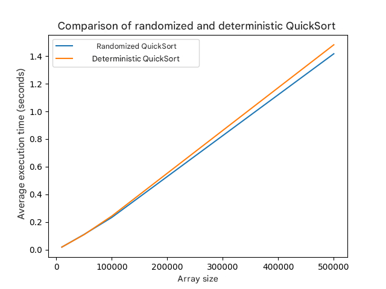
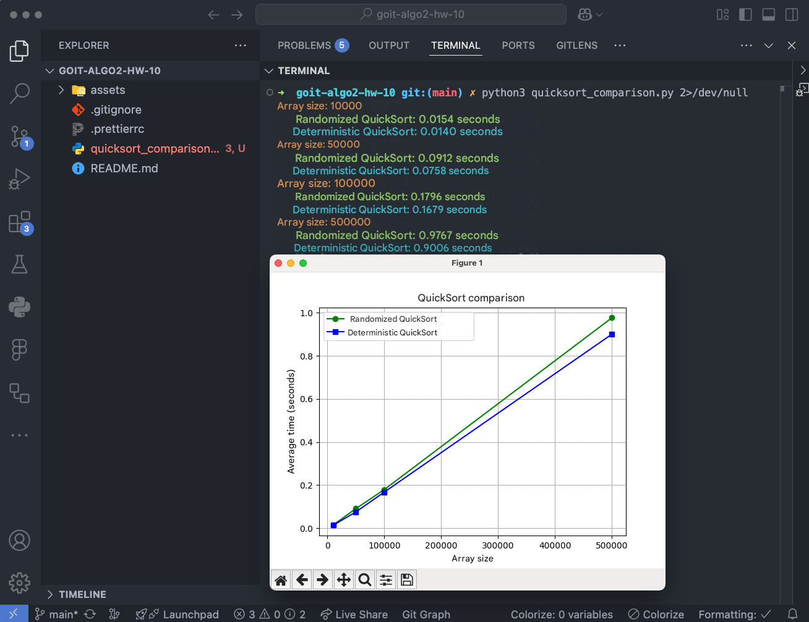
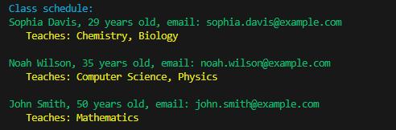

# Homework for the topic "Algorithmic complexity, approximate and randomized algorithms"

Hello!👋🏻 Ready for a new challenge?

The homework will consist of two independent tasks.

In the first task, you will learn to implement different variants of the QuickSort algorithm, conduct empirical studies of their effectiveness, and visualize the results. Working with large data sets, you will deepen your understanding of the impact of the choice of a support element on sorting performance and the difference between deterministic and randomized approaches.

Such practical experience will develop your skills in critical thinking and conducting experimental research in the field of algorithms.

By completing the second task, you will learn to implement a greedy algorithm to solve a real-world optimization problem - scheduling classes. The task
will help you understand how to use a greedy approach to minimize resources
(in this case, the number of teachers) while achieving the set goals
(covering all subjects).

You will also learn to work with selection criteria, implementing priority logic.
You will also prepare to apply such methods in real projects.

This experience will help you better understand the principles of greedy algorithms and
their application to solve practical optimization problems.

Fly away!! 🚵🏻‍♀️

## Task 1. Comparison of randomized and deterministic QuickSort

Implement randomized and deterministic QuickSort sorting algorithms.
Conduct a comparative analysis of their efficiency by measuring the average execution time on arrays of different sizes.

### Specifications

1. To implement the randomized QuickSort algorithm, implement the function
`randomized_quick_sort(arr)`, where the pivot element (pivot) is chosen
randomly.

2. To implement the deterministic QuickSort algorithm, implement the function
`deterministic_quick_sort(arr)`, where the pivot element is chosen according to a fixed
rule: the first, last, or middle element.

3. Create a set of test arrays of different sizes: `10_000`, `50_000`,
`100_000`, and `500_000` elements. Fill the arrays with random integers.

4. Measure the execution time of both algorithms on each array. For a more accurate
estimate, repeat the sorting of each array 5 times and calculate the average execution time.

### Acceptance criteria

📌 The homework acceptance criteria are a mandatory condition for the mentor to consider the task. If any of the criteria are not met, the homework is sent by the mentor for revision without evaluation. If you "just need to clarify"😉 or you are "stuck" at any stage of execution - contact the mentor in Slack.

1. The `randomized_quick_sort` and `deterministic_quick_sort` functions implement sorting algorithms and sort arrays (20 points).

2. The execution time of the algorithms is measured and presented in the form of a table and a graph (10 points).

3. Graphs are constructed, with axis labels and a legend (5 points).

4. The results are analyzed and conclusions are drawn regarding the effectiveness of the randomized and deterministic QuickSort (10 points).

5. The code executes the usage example and meets the expected results (5
points).

### Example of plotting the program



### Example of output to the terminal of the program

```bush
Array size: 10000 Randomized QuickSort: 0.0189 seconds Deterministic
QuickSort: 0.0189 seconds

Array size: 50000 Randomized QuickSort: 0.1104 seconds Deterministic
QuickSort: 0.1090 seconds

Array size: 100000 Randomized QuickSort: 0.2333 seconds Deterministic
QuickSort: 0.2435 seconds .

Array size: 500000 Randomized QuickSort: 1.4166 seconds Deterministic
QuickSort: 1.4815 seconds
```

## Task 2. Class Schedule Generation Using a Greedy Algorithm

Implement a program for class scheduling at a university using a greedy algorithm for the set coverage problem. The goal is to assign teachers to subjects in a way that minimizes the number of teachers and covers all subjects.

### Specifications

Given a set of subjects: {'Mathematics', 'Physics', 'Chemistry', 'Informatics',
'Biology'}


List of teachers:

John Smith, 50 years old, john.smith@example.com, subjects: {'Mathematics', 'Physics'}

Emma Johnson, 32 years old, emma.johnson@example.com, subjects: {'Chemistry'}

Liam Brown, 50 years old, liam.brown@example.com, subjects: {'Computer Science', 'Mathematics'}

Sophia Davis, 29 years old, sophia.davis@example.com, subjects: {'Biology', 'Chemistry'}

Noah Wilson, 35 years old, noah.wilson@example.com, subjects: {'Physics', 'Computer Science'}

Olivia Taylor, 42 years old, olivia.taylor@example.com, subjects: {'Biology'}

### Task description

- Implement the `Teacher` class with the following attributes:
- `first_name` (first name)
- `last_name` (last name)
- `age` (age)
- `email` (email)
- `can_teach_subjects` (set of subjects that can be taught)
- Implement the `create_schedule(subjects, teachers)`, which uses a greedy algorithm to assign teachers to subjects. The function should
return a list of teachers and the subjects assigned to them.
- When choosing a teacher at each stage, give preference to the one who can
teach the largest number of subjects that are not yet covered. If there are several such candidates, choose the youngest by age.

### Acceptance criteria

1. The program covers all subjects from the set of subjects (20 points).

2. If it is impossible to cover all subjects with the available teachers, the program should
display a message about this (15 points).

3. All subjects must be covered by teachers, and all teachers must be assigned
to their subjects (15 points).

Program template

```python
# Definition of the Teacher class

class Teacher: pass

def create_schedule(subjects, teachers): pass

if **name** == '**main**': # Set of subjects subjects = {} # Create a list of
teachers teachers = []

# Call the schedule creation function
schedule = create_schedule(subjects, teachers)

# Output the schedule
if schedule:
print("Class schedule:")
for teacher in schedule:
print(f"{teacher.first_name} {teacher.last_name}, {teacher.age} years, email: {teacher.email}")
print(f" Teaches subjects: {', '.join(teacher.assigned_subjects)}\\n")
else:
print("Unable to cover all subjects with available teachers.")
```

## Preparing and uploading homework

1. Create a public repository `goit-algo2-hw-10`.

2. Complete the task and submit it to your repository.

3. Download the working files to your computer and attach them to the LMS as a
`zip` archive. The archive name must be in the format `DZ10_NAME`.

4. Attach a link to the repository `goit-algo2-hw-10` and submit for
verification.

## Submission format

- Attached repository files in `zip` format with the name `DZ10_NAME`.

- Link to the repository.

## Evaluation format

Score from 0 to 100.

Task 1 is evaluated at 50 points.

Task 2 is evaluated at 50 points.

Detailed distribution of points is specified in the acceptance criteria.

☝🏻ATTENTION!! You have the opportunity to choose an approach to completing and possibly completing the homework: Be satisfied with the first grade received (of course, if it is higher than the passing score). Try to get a higher score by possible subsequent completion of the work in accordance with the mentor's feedback. The chosen approach to completing the homework must be indicated in the submission field for the attached task. In the absence of a comment, the mentor adheres to the first approach and issues the received grade. 💡 Send the homework for verification when everything possible has been done, since the number of attempts to complete the task affects the score received! For each subsequent attempt,
starting from the third, the maximum possible number of points is reduced by 5.
Criteria for evaluating works in the GoIt Neoversity master's degree

### Result of the completed DZ

#### Task 1



#### Task 2

